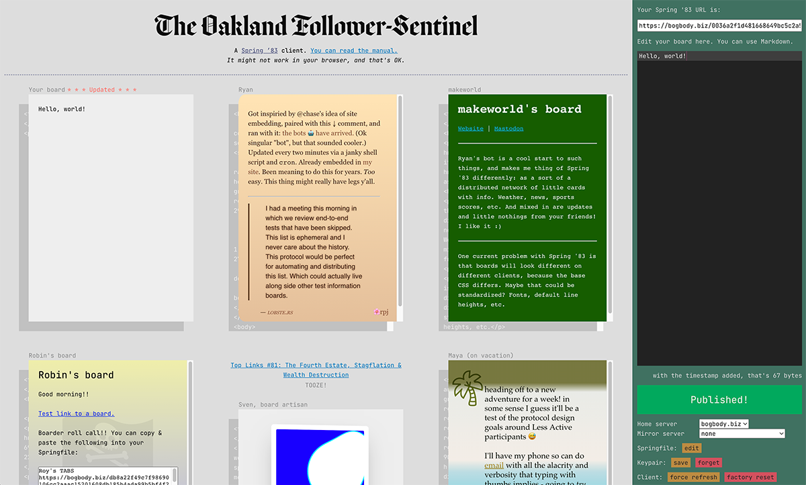

The Oakland Follower-Sentinel is a demo Spring '83 client that you can access at TKTK.



If you haven't read anything about Spring '83 yet, everything that follows will probably be confusing. I recommend starting with [this narrative description](https://github.com/robinsloan/spring-83-spec) and then perhaps reading [the protocol specification](https://github.com/robinsloan/spring-83-spec).

This is speculative software intended to invite consideration and imagination; it doesn't have any "users" yet, only co-investigators. That's you!

## Basic operation

Without doing anything, you can use the client to follow a default list of boards and feeds. There are worse things in the world! You will probably find the feed selection fairly gnomic; that's because they are my feeds, not yours.

If you press `Esc`, an editor will appear. It's here that you can add, remove, and re-arrange Spring '83 URLs and RSS feed URLs. The client will save these changes to your browser's `localStorage`, so there is a fair chance your changes will still be there when you return. There you go: a super simple way to follow a collection of boards and feeds.

Perhaps you'd like to publish a board of your own. To "unlock" the client's publishing panel, you'll need a keypair that conforms to the Spring '83 specification. In the client, you'll find a link to a page where you can generate one.

This takes some time; have patience, and faith.

Once you have a keypair file, you can use it to unlock the publishing panel and, perhaps, jot something on your board! If, having done this, you'd like me to add it the running list publicized in [this board](https://bogbody.biz/0036a2f1d481668649bc5c2a50f40cc9a65d3244eff0c0002af812e6183e0523), just send me an email, `robin@robinsloan.com`.

Your keypair file is irreplaceable, so be sure to back it up somewhere, somehow. If you misplace it, you'll lose access to the associated board, and you'll have to start over with a new keypair.

Spring '83 doesn't "do" discovery or promotion on the protocol level, so publicizing your new board is totally up to you. Post the URL on your website, share it in a chat room, email it to your co-conspirators... or don't do any of those things, and just type into a box that doesn't circulate anywhere. That might sound ironic, but it's not; in my experience, simply "typing into the box" delivers a surprising fraction of the pleasure of internet publishing.

## Tips and tricks

You can press `Esc` to toggle the Springfile editor. 

If you click on a link to a Spring '83 URL, the client will show you a preview, with a quick-selectable URL that makes it easy to add that board to your Springfile, if you wish.

The client tries its best to synchronize your Springfile across different browsers using the same keypair. You can turn this off by adding this line to your Springfile:

`set sync false`

Data loss is inevitable and assured. Happily, it's a breeze to back up a Springfile. Just email it to yourself!

In additional to HTML, you can compose your board in Markdown, keeping in mind that Markdown permits arbitrary mixing-and-matching: write a couple paragraphs in Markdown, throw in a little HTML confection. Easy!

This is a non-realtime system. The demo client insists on luxurious pauses and timeouts; don't expect to see boards percolating while you watch.

## Running the client locally

You can totally do this, too. Just clone the repository and run:

```
ruby serve.rb
```

This script is included as a convenience; you can substitute any directory serving scheme, or even host the client on a website of your own.

## Status

This demo client will not be a long-term project -- I simply am not an application developer -- but/and I knew it was important to demonstrate my (very rough) vision for how Spring '83 might look and work.

Important for me, as much as for anyone else!

I will continue to tinker here, and I'll happily accept bug reports, although I might not be able to do anything about them. I am not seeking pull requests, but/and you should feel free to use this code as a starting point for your own explorations.

Thanks for investigating!